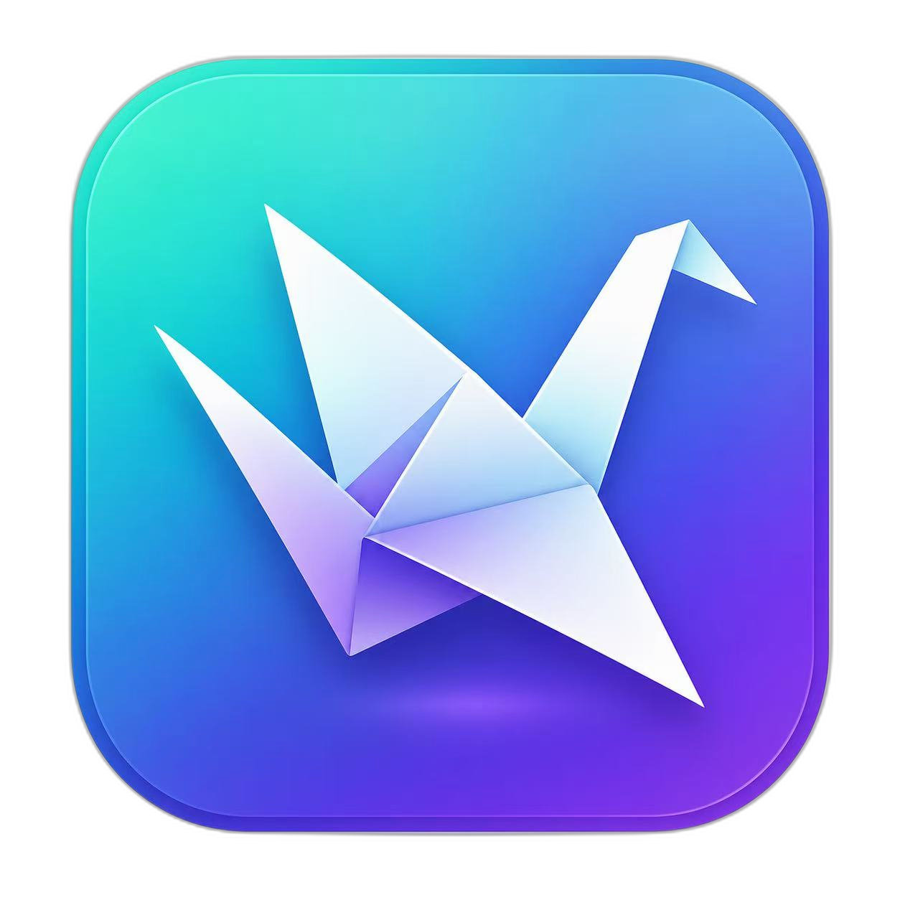

<div align="center">

<a href="https://github.com/Renxint/origami">
  
</a>

<p align="center">
  <a href="https://github.com/Renxint/origami">
    
  </a>
</p>




</div>

<p align="center">
  
  
  
  
  
  
  
  
</p>

<p align="center">
  <a href="https://github.com/Renxint/origami">
    
  </a>
</p>

<div align="center">
  
</div>

<div align="center">

👏 使用中遇到问题？欢迎提交 [Issue](https://github.com/Renxint/origami/issues)

</div>

---

## ✨ 亮点

| 🧩 插件式架构 | 🎨 原生桌面体验 | 🛡️ 纯本地 · 无数据收集 |
|:---:|:---:|:---:|
| PlatformAdapter 设计模式 | PyQt6 深色/亮色主题 | 所有数据留在你的电脑上 |
| 新平台三步入驻 | 托盘运行 · 快捷键 · 单实例 | SignPath 代码签名 · MIT 开源 |

> 💡 Origami 是一个**多平台内容管理桌面应用**，采用插件式架构。当前支持多个内容平台的内容获取与本地归档。本项目也是 Python 桌面应用开发与网络协议逆向的**学习实践**。

---

## 🏗️ 技术架构

```
src/platforms/          ← 插件式平台适配器（策略模式 + 注册表）
  ├── base.py           ← PlatformAdapter 抽象基类（接口契约）
  ├── douyin.py         ← 平台适配器实现
  └── __init__.py       ← 全局注册表，新平台一行 import 即可接入

sign-server/            ← Node.js 签名与反爬服务（独立进程）
src/gui/                ← PyQt6 原生桌面界面
src/webview_api.py      ← Puppeteer 自动化引擎
```

**核心技术栈：** Python 3.12 · PyQt6 · Node.js · Puppeteer · requests

**工程化：** Inno Setup 安装器 · SignPath 代码签名 · 单实例检测 · 自动更新

---

## 📥 安装

| 方式 | 链接 |
|------|------|
| **安装包（推荐）** | [📦 下载 Origami_v0.6.0_setup.exe](https://github.com/Renxint/origami/releases/latest) |
| **免安装版** | [📁 下载便携版](https://github.com/Renxint/origami/releases) |

---

## 📖 使用指南

### 安装

1. 下载 `Origami_v0.6.0_setup.exe`，双击安装
2. 或在 [Releases](https://github.com/Renxint/origami/releases) 下载免安装版

### 登录

1. 启动后点击首页平台卡片
2. 点击右上角「点击登录 →」
3. 在弹出的浏览器中扫码登录
4. 登录成功后自动返回，显示头像和昵称

### 单个作品

1. 首页 → 选择平台 → 单个作品
2. 粘贴分享链接或口令
3. 点击「开始」
4. 图集作品可选择要保存的图片
5. 完成后可打开所在文件夹

### 批量归档

1. 首页 → 选择平台 → 批量
2. 粘贴主页链接
3. 选择数量，点击「开始」
4. 支持暂停 / 取消

### 个人主页

1. 批量页 → 切换到「自己」标签
2. 登录后自动加载账号信息和作品统计
3. 点击「查看列表」→ 勾选 → 开始

---

## ⌨️ 快捷键

| 快捷键 | 功能 |
|--------|------|
| `Ctrl + H` | 回到首页 |
| `Ctrl + ,` | 打开设置 |
| `Ctrl + Q` | 退出 |
| `Esc` | 最小化到托盘 |

---

## 🛠️ 从源码运行

### 环境要求

- Python 3.12+
- Node.js（用于签名服务）

### 启动

```bash
git clone https://github.com/Renxint/origami.git
cd origami

# 安装 Python 依赖
pip install -r requirements.txt

# 安装 Node.js 依赖
cd sign-server && npm install && cd ..

# 启动
python main.py
```

---

## 🔌 新增平台

三步接入新平台：

1. 创建 `src/platforms/newplatform.py`
2. 继承 `PlatformAdapter`，实现 `resolve_url` / `fetch_media` / `fetch_author` / `fetch_posts`
3. 在文件末尾调用 `register_platform(NewPlatformAdapter)`

GUI 自动识别所有已注册平台，无需修改界面代码。

---

## 📁 项目结构

```
Origami/
├── main.py              # 入口
├── src/
│   ├── environ.py       # 环境路径
│   ├── config.py        # 全局配置
│   ├── api.py           # HTTP API 客户端
│   ├── cookie.py        # Cookie 管理
│   ├── downloader.py    # 通用下载引擎
│   ├── utils.py         # 工具函数
│   ├── webview_api.py   # Puppeteer 自动化
│   ├── settings/        # 配置管理
│   ├── platforms/       # 平台适配器（插件式架构）
│   └── gui/             # PyQt6 界面
├── sign-server/         # Node.js 签名服务
├── translations/        # Qt 中文翻译
└── src/gui/assets/      # 图标 / 字体
```

---

## 🙏 致谢

- 代码签名由 [SignPath.io](https://signpath.io) 免费提供，证书由 [SignPath Foundation](https://signpath.org/) 颁发

---

## ⚠️ 声明

本项目为 Python 桌面应用开发与网络协议学习的**实践项目**，源代码仅用于个人研究。

请遵守各平台服务条款，在授权范围内使用。使用者自行承担所有责任。

---

## 👥 贡献者

<a href="https://github.com/Renxint/origami/graphs/contributors">
  
</a>

---

## 📊 项目活跃度

<p align="center">
  <a href="https://github.com/Renxint/origami">
    
  </a>
</p>

---

## ⭐ Star History

<a href="https://www.star-history.com/#Renxint/origami&Date">
  <picture>
    <source media="(prefers-color-scheme: dark)" srcset="https://api.star-history.com/svg?repos=Renxint/origami&type=Date&theme=dark" />
    <source media="(prefers-color-scheme: light)" srcset="https://api.star-history.com/svg?repos=Renxint/origami&type=Date" />
    
  </picture>
</a>

---

## 📄 许可证

MIT License — © 2026 Renxint

---

<div align="center">


Made with ❤️ by [Renxint](https://github.com/Renxint)

</div>
