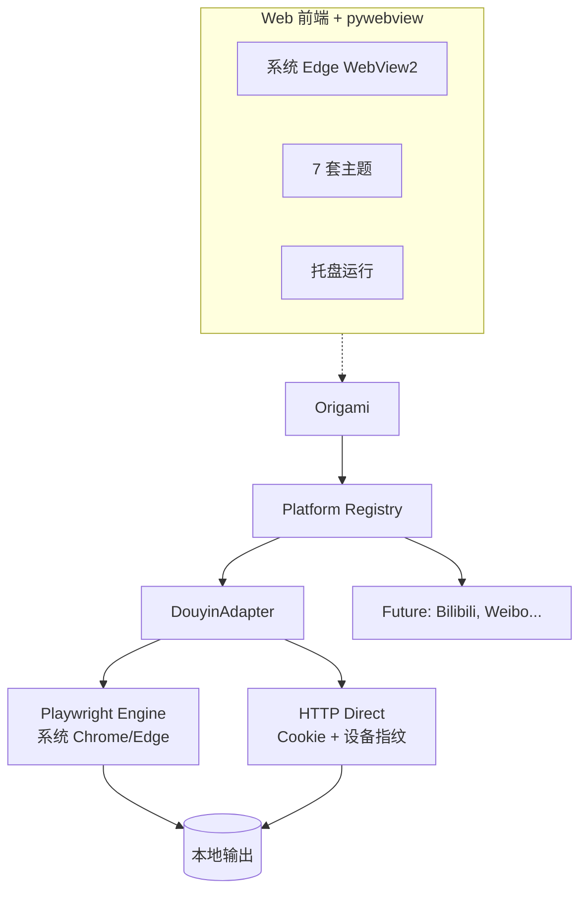

<div align="center">

<a href="https://github.com/Renxint/origami">
  
</a>

<p align="center">
  <a href="https://github.com/Renxint/origami">
    
  </a>
</p>

<a href="https://github.com/Renxint/origami"></a>


</div>

<p align="center">
  
  
  
  
  
  
  
  
    
  
  
  
</p>

<p align="center">
  <a href="https://github.com/Renxint/origami">
    
  </a>
</p>

<div align="center">
  
</div>

<div align="center">

👏 使用中遇到问题？欢迎提交 [Issue](https://github.com/Renxint/origami/issues)

</div>

---

<div align="center">

## ✨ 亮点

| 🧩 插件式架构 | 🎨 原生桌面体验 | 🛡️ 纯本地 · 无数据收集 |
|:---:|:---:|:---:|
| PlatformAdapter 设计模式 | PyQt6 原生桌面 | 所有数据留在你的电脑上 |
| 新平台三步入驻 | 托盘运行 · 快捷键 · 单实例 | SignPath 签名 · CI/CD 构建 · MIT |

</div>

> 💡 Origami 是一个**多平台内容管理桌面应用**，采用插件式架构。当前支持多个内容平台的内容获取与本地归档。本项目也是 Python 桌面应用开发与网络协议逆向的**学习实践**。

---

## 🏗️ 技术架构

### v2 (当前开发分支)



| 层次 | v2 | v0.6.x |
|------|-----|--------|
| **语言** | Python 3.12 | Python 3.12 |
| **桌面框架** | pywebview + WebView2 | PyQt6 |
| **反爬引擎** | Playwright (Python) | Puppeteer + Node.js |
| **HTTP** | requests | requests |
| **API 服务** | aiohttp | - |
| **体积** | ~20MB | 132MB |
| **工程化** | Inno Setup · 单实例 · 自动更新 | 同左 |

---

## 🎯 平台支持

| 平台 | 状态 | 能力 |
|------|:---:|------|
| 🎵 抖音 | ✅ 已支持 | 视频 · 图集 · 实况 · 主页批量 |
| 📺 B站 | 🚧 开发中 | 基于 [Evil0ctal](https://github.com/Evil0ctal/Douyin_TikTok_Download_API) B站实现适配 |
| 📝 微博 | 📋 计划 | PlatformAdapter 三步入驻 |
| ▶️ YouTube | 📋 计划 | yt-dlp 集成方案 |

> 🔌 新平台接入只需继承 `PlatformAdapter`，GUI 自动识别，无需改界面代码。

---

## 📥 安装

<p align="center">
  <a href="https://github.com/Renxint/origami/releases/latest">📦 安装版 (推荐)</a>
  &nbsp;&nbsp;·&nbsp;&nbsp;
  <a href="https://github.com/Renxint/origami/releases">📁 免安装版</a>
</p>

---

## 📖 使用指南

### 安装

1. 下载最新 `Origami_v*_setup.exe`，双击安装
2. 或在 [Releases](https://github.com/Renxint/origami/releases) 下载免安装版

### 登录

1. 启动后点击首页平台卡片
2. 点击右上角「点击登录 →」
3. 在弹出的浏览器中扫码登录
4. 登录成功后自动返回，显示头像和昵称

### 单个作品

1. 首页 → 选择平台 → 单个作品
2. 粘贴分享链接或口令
3. 点击「开始」
4. 图集作品可选择要保存的图片
5. 完成后可打开所在文件夹

### 批量归档

1. 首页 → 选择平台 → 批量
2. 粘贴主页链接
3. 选择数量，点击「开始」
4. 支持暂停 / 取消

### 个人主页

1. 批量页 → 切换到「自己」标签
2. 登录后自动加载账号信息和作品统计
3. 点击「查看列表」→ 勾选 → 开始

---

## ⌨️ 快捷键

| 快捷键 | 功能 |
|--------|------|
| `Ctrl + H` | 回到首页 |
| `Ctrl + ,` | 打开设置 |
| `Ctrl + Q` | 退出 |
| `Esc` | 最小化到托盘 |

---

## 🛠️ 从源码运行

### v2 (当前开发)

```bash
git clone https://github.com/Renxint/origami.git
cd origami
git checkout v2

pip install -r requirements.txt

# 扫码登录（首次使用）
python -m src.main login

# 桌面版
python src/desktop.py

# 或 Web 模式
python -m src.main server
# 浏览器打开 http://localhost:8765

# CLI 模式
python -m src.main cli single "https://v.douyin.com/xxxxx/"
python -m src.main cli batch "https://v.douyin.com/xxxxx/" --count 10
```

### v0.6.x (稳定版)

```bash
git checkout main
pip install -r requirements.txt
cd sign-server && npm install && cd ..
python main.py
```

---

## 🔌 新增平台

三步接入新平台：

1. 创建 `src/platforms/newplatform.py`
2. 继承 `PlatformAdapter`，实现 `resolve_url` / `fetch_media` / `fetch_author` / `fetch_posts`
3. 在文件末尾调用 `register_platform(NewPlatformAdapter)`

GUI 自动识别所有已注册平台，无需修改界面代码。

---

## 📁 项目结构

```
Origami/
├── main.py              # 入口
├── src/
│   ├── environ.py       # 环境路径
│   ├── config.py        # 全局配置
│   ├── api.py           # HTTP API 客户端
│   ├── cookie.py        # Cookie 管理
│   ├── downloader.py    # 通用下载引擎
│   ├── utils.py         # 工具函数
│   ├── webview_api.py   # Puppeteer 自动化
│   ├── settings/        # 配置管理
│   ├── platforms/       # 平台适配器（插件式架构）
│   └── gui/             # PyQt6 界面
├── sign-server/         # Node.js 签名服务
├── translations/        # Qt 中文翻译
└── src/gui/assets/      # 图标 / 字体
```

---

## 🗺️ 代码地图

<p align="center">
  
</p>

---

## 🙏 致谢

- 代码签名由 [SignPath.io](https://signpath.io) 免费提供，证书由 [SignPath Foundation](https://signpath.org/) 颁发

---

## 👥 贡献者

<a href="https://github.com/Renxint/origami/graphs/contributors">
  
</a>

---

## 📊 项目活跃度

<p align="center">
  <a href="https://github.com/Renxint/origami">
    
  </a>
</p>

---

## 🐍 提交贪吃蛇

<p align="center">
  
</p>

---

## ⭐ Star History

<a href="https://www.star-history.com/#Renxint/origami&Date">
  <picture>
    <source media="(prefers-color-scheme: dark)" srcset="https://api.star-history.com/svg?repos=Renxint/origami&type=Date&theme=dark" />
    <source media="(prefers-color-scheme: light)" srcset="https://api.star-history.com/svg?repos=Renxint/origami&type=Date" />
    
  </picture>
</a>

---

## 📄 许可证

MIT License — © 2026 Renxint

---

<div align="center">


</div>

---

> [!CAUTION]
> **本项目为 Python 桌面应用开发与网络协议学习的实践项目**，源代码仅用于个人研究。
>
> 请遵守各平台服务条款，在授权范围内使用。
>
> 使用者自行承担所有责任。
